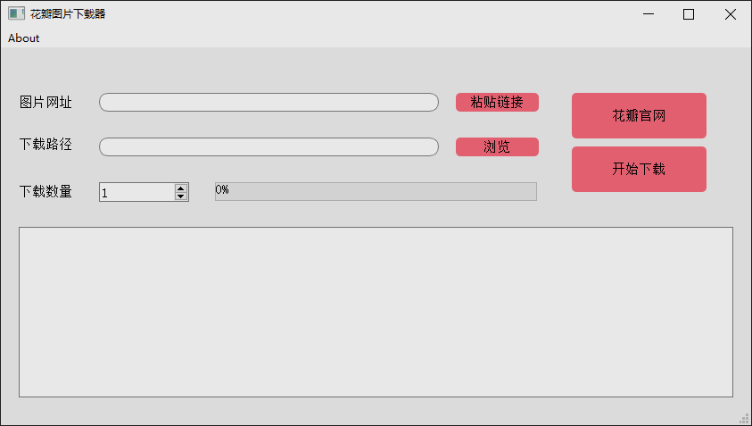

# HuabanScraper
* 花瓣网爬虫，自动下载图片
* 多线程下载
* 命令行+图形界面
* 可以指定下载图片的数量
* 支持<画板>，<单图>，<首页发现>，\<XHR>等多种url解析

---

## 1. 原理

requests+json的方式，直接解析json中图片的key值，拼接图片下载地址，收集到所有图片的地址以后，使用多线程下载，速度较快。

---

## 2. 使用方法

### 2.1 图形界面

在[releases](https://github.com/Koril33/HuabanScraper/releases)中下载软件，目前支持以下几种url格式：

> 首页的发现：https://huaban.com/discovery/beauty/
>
> 普通的画板：https://huaban.com/boards/3114850/
>
> 单张图片：https://huaban.com/pins/3116250674/
>
> XHR：https://huaban.com/boards/3114850/?k99otknb&max=2857420870&limit=20&wfl=1



---

### 2.2 命令行

在“command_exe”文件夹下，有直接用pyinstaller打包好的命令行软件。

格式：

```
huaban_command.exe --url [URL] --max [MAX_NUM] --path [FOLDER_NAME]
```

需要有三个参数：

1. `--url`，需要下载的url（必选参数）。

2. `--max`，下载图片最大数量（不指定此参数的话，默认下载10张）如果设置的数量超过画板内图片的总数，则将此画板所有图片下载下来。

3. `--path`，文件夹名字（不指定此参数的话，默认名字为‘huaban_pictures’），用来新建一个文件夹，保存下载的图片。

```
huaban_command.exe --url https://huaban.com/explore/piqiaqiubizhi/ --max 50 --path 皮卡丘壁纸
```

上面这行命令，就是从指定的网页上下载前50张图片，并保存到名为“皮卡丘壁纸”的文件夹下。
